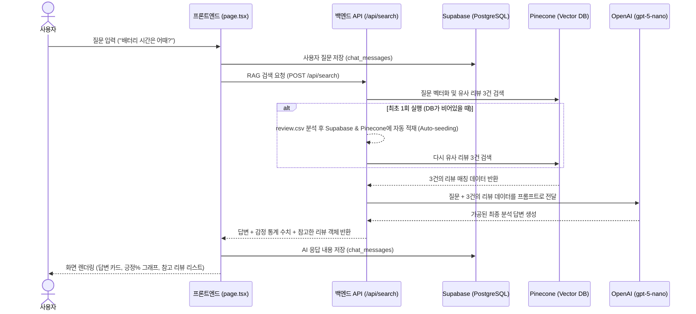

# 🎧 쇼핑 리뷰 분석 챗봇 (ReviewAI)

1,200건의 실제 사용자 구매 리뷰 데이터를 기반으로 객관적인 상품 분석 요약을 제공하는 **Retrieval-Augmented Generation (RAG) 챗봇 서비스**입니다. 

실시간 감정 분석 수치, 관련도 높은 개별 구매 후기 레코드를 함께 보여주며, 사용자 질문에 가장 최적화된 상품 정보 인사이트를 제공합니다.

---

## 🛠️ 기술 스택 및 기술 선정 이유

본 프로젝트는 대화형 인터페이스의 빠른 응답 속도, 의미 기반 리뷰 탐색, 대화 내역 영구 보존을 만족하기 위해 다음의 기술들로 구성되어 있습니다.

| 기술 분류 | 기술 스택 | 핵심 역할 | 선정 이유 |
| :--- | :--- | :--- | :--- |
| **프레임워크** | **Next.js 16 (App Router)<br>React 19** | 웹 어플리케이션의 UI 렌더링 및 백엔드 API 엔드포인트 제공 | 하나의 프로젝트 내에서 화면 단과 서버 API 라우트를 동시에 구축하여 개발 생산성을 높이며, Turbopack 및 SSR 지원으로 최적화가 우수합니다. |
| **스타일링** | **Vanilla CSS (CSS Modules)** | 사용자 인터페이스의 디자인 시스템 및 스타일링 적용 | 외부 디자인 프레임워크 오버헤드가 없으며, CSS 클래스명 충돌 걱정 없이 경량화된 UI를 직관적이고 커스텀하여 스타일링할 수 있습니다. |
| **AI 조율** | **LangChain (JS/TS)** | AI 모델(OpenAI) 호출 및 벡터 스토어(Pinecone) 조회 오케스트레이션 | 프롬프트 템플릿 처리, Pinecone 유사도 검색 통합 흐름을 유연하게 제어하며, 프롬프트 엔지니어링 및 결합도를 낮추는 구조적 안정성을 줍니다. |
| **AI 모델** | **OpenAI (gpt-5-nano)** | Pinecone에서 검색한 구매 리뷰 데이터를 종합 요약해 최종 분석 답변 생성 | 응답 속도가 획기적으로 향상된 경량화된 소형 모델로, 긴 리뷰 컨텍스트 분석 및 챗봇의 실시간 피드백 생성에 매우 경제적이고 우수합니다. |
| **벡터 DB** | **Pinecone (Vector DB)** | 비정형 리뷰 문장들의 고차원 벡터 임베딩 저장 및 유사도 검색 | 서버리스 아키텍처 환경에서 대기 시간 없는 빠른 검색 속도를 지원하며, `llama-text-embed-v2` 모델을 내장 활용하여 추가 인프라 구축 없이 RAG를 구성합니다. |
| **관계형 DB** | **Supabase (PostgreSQL)** | 대화 세션 기록, 대화방 메시지 히스토리 내역, 원본 리뷰 테이블의 영구 보존 | PostgreSQL 데이터베이스를 기반으로 행 수준 보안(RLS) 및 자동 REST API를 제공하여 클라이언트 브라우저 단에서 직접 연동 속도와 영속성을 극대화합니다. |
| **데이터 원본** | **Local CSV (`samples/review.csv`)** | 쇼핑몰 실제 구매 리뷰 100건 원본 데이터 소스 제공 | 텍스트 파일 기반의 데이터 구조로 초기 Pinecone 벡터 적재 및 Supabase 백엔드 테이블 동기화를 위한 원본 기초 자료가 됩니다. |

---

## 🏗️ 시스템 아키텍처 및 연동 흐름 (RAG Flow)

사용자가 대화창에서 질문을 전송하면 시스템은 다음과 같은 흐름으로 동작합니다:



---

## ⚙️ 로컬 실행 및 설치 방법

### 1. 환경 변수 구성 (.env)
프로젝트 루트 폴더에 `.env` 파일을 생성하고 아래 키를 입력합니다.
```env
PINECONE_API_KEY=본인의_Pinecone_API_Key
PINECONE_HOST=본인의_Pinecone_Index_Host_Url
NEXT_PUBLIC_SUPABASE_URL=본인의_Supabase_프로젝트_URL
NEXT_PUBLIC_SUPABASE_PUBLISHABLE_KEY=본인의_Supabase_Publishable_Anon_Key
OPENAI_API_KEY=본인의_OpenAI_API_Key
```

### 2. 패키지 설치 및 빌드
```bash
# 의존성 패키지 설치 (피어 의존성 무시 옵션 포함)
npm install --legacy-peer-deps

# 개발용 로컬 서버 실행
npm run dev

# 프로덕션 빌드 검증
npm run build
```

### 3. 데이터베이스 테이블 생성 (마이그레이션 푸시)
Supabase CLI를 사용해 대화 및 리뷰 저장을 위한 테이블 스키마들을 데이터베이스에 구축합니다.
```bash
npx supabase db push --password "본인의_Supabase_DB_비밀번호"
```
*(명령어가 성공적으로 수행되면 Supabase의 Table Editor 화면에 `chat_sessions`, `chat_messages`, `reviews` 테이블이 생성됩니다.)*

### 4. 자동 연동 및 시작 (Auto-seeding)
* 번거로운 수동 업로드 작업 필요 없이, 웹 페이지(`http://localhost:3000`)에 접속하여 첫 질문을 전송하기만 하면 **자동으로 CSV 로컬 데이터를 Supabase와 Pinecone에 나누어 업로드**합니다.
* 최초 1회 자동 적재가 완료된 이후부터는 OpenAI의 `gpt-5-nano` 모델의 빠른 지능형 RAG 분석이 시작됩니다.
